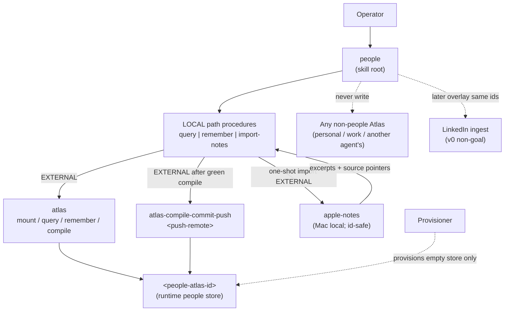
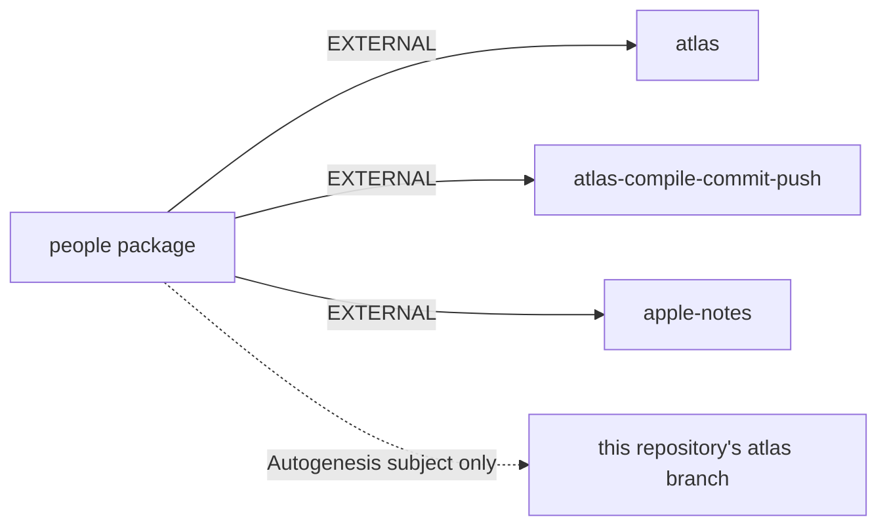

# Plan: people (operator-owned people Atlas)

**work_id:** `2026-10-05-people-atlas`  
**change-class:** `new-skill`  
**Subject package:** the `people` skill package (published standalone as `atlas-people` from v0.1.2; paths below are relative to the package root).  
**Status:** done. Approved by the maintainer and implemented on 2026-10-05.

**Autogenesis subject Atlas (this store):** this repository's `atlas` branch (ref `atlas`; the `atlas_id` recorded in this store's `CONTRACT.json`) — plans, work and experiences only.  
**Runtime people store (provisioned separately):** `<people-atlas-id>` — the network and contact list; **not** this Autogenesis subject.

Distribution as first pinned: private install only, never published to a marketplace. **Superseded on 2026-10-09:** the maintainer lifted that rule and approved public publication as `atlas-people` (see [publish publicly](../../decisions/2026-10-09-publish-publicly.md)). People pages are never nested in any non-people Atlas (the operator's personal or work Atlas, another agent's Atlas). The provisioner is not consulted during this design run; a provisioning blocker note is left for implement.

British English. Prose uses **roles** (the operator, the provisioner, the maintainer), not named people.

The derived skill stays instruction-first. It does not copy Autogenesis invocation, validators, or trace machinery.

## Autogenesis Enter card (recorded)

```text
schema: autogenesis.invocation-request/v1
request_id: ag-design-2026-10-05-people-atlas
parent_request_id: null
target: {skill: autogenesis, module: design, role: operation}
operation: design
arguments:
  objective: Design package people — operator-owned people Atlas as runtime store; query/remember; one-shot Apple Notes ingest; LinkedIn later; stop for approval; do not implement
  behavioural_contract: deferred:agent-spec-specify-after-design-approval
  change_evidence: maintainer-pinned decisions 2026-10-05 (ownership, richer pages, Notes one-shot, secrets standing)
context:
  subject: people
  mode: run
  operation: design
  work_id: 2026-10-05-people-atlas
  atlas_id: <this-atlas-id>
  atlas_root: <atlas-root>
  approval_ref: null
resolved:
  skill_root: <install-root>/autogenesis
  module_root: <install-root>/autogenesis/references/modules/design
  entrypoint: <install-root>/autogenesis/references/modules/design/SKILL.md
state: requested
```

## Intent

Give **the operator** one skill that treats a **dedicated people Atlas** as the durable network and contact list: query and remember people and typed relationships; run a **one-shot Apple Notes** import that extracts people, claims, and richer excerpts with source pointers; leave LinkedIn and continuous Notes sync for later overlays on the same stable person ids. Neutral across personal and professional life. The provisioner only creates the server user and empty store; the operator owns the content and the skill.

One-line purpose: **Stable people + relationships on an operator-owned Atlas; Notes proves the shape once; never nest in any non-people Atlas.**

## Problem (why this Run)

1. Contacts and relationship context sit in Apple Notes (and later LinkedIn) without a stable, queryable graph the operator's agent can remember across sessions.
2. The operator's personal and work Atlases must stay domain-pure; a people graph that spans both must not live inside either.
3. Identity merge is the hard part of personal CRMs — names alone false-merge; Apple/CNContact ids are not durable cross-device anchors.
4. The secrets standing already forbids naming 1Password item titles/ids/vaults in skills or Atlas process pages; richer excerpts must still exclude password/SSN-class secrets.
5. Continuous sync and multi-source ingest before the schema is proven would cement the wrong shape.

## Scope

**In:**

- New skill package `people` (hybrid layout shared with its sibling packages: root `SKILL.md`, `.apm/skills/people/`, `apm.yml`, `README.md`, `atlas-mesh.json` pointing the Autogenesis subject at this repository's `atlas` branch, `references/` for path procedures and scenarios).
- **Package name justification:** `people` (not `people-atlas`). The skill is the procedure package; the runtime store is the Atlas. An `-atlas` suffix on the skill would conflate package and store and diverge from sibling packages, which name the procedure rather than the store. (Distribution note, 2026-10-09: the standalone public package is published as `atlas-people`; see the publication decision.)
- **Provisioning recommendation (design only):** short neutral slug `people` on the operator's Atlas host, giving store id `<people-atlas-id>`. Alternative if multi-tenant naming must encode the owner: an owner-prefixed slug. Prefer the short neutral `people` under operator ownership.
- Runtime write-home: **only** that people Atlas. Working checkout at `<atlas-root>`. Sole push target after green compile: `<push-remote>` via EXTERNAL `atlas-compile-commit-push`.
- Query / remember procedures for people and typed relationship edges.
- Richer person pages: bio, history, notes excerpts OK; plus stable id, names/aliases, typed relationship edges, source pointers.
- One-shot Apple Notes ingest documented and implemented only after approval: extract people + claims + excerpts with source pointers (prefer Notes **id**, never title alone).
- LinkedIn left as a later overlay on the same person ids (non-goal for the v0 body; schema must not block it).
- Portable adversarial draft + evaluation plan; SOLID five-row; Catalogue Review; stop-for-approval.
- Implement todos listed only after approval — not executed in this Run.

**Out (non-goals):**

- Implementing the skill body or creating the server user / empty store in this Run.
- Continuous Apple Notes sync.
- LinkedIn (or other) ingest in v0.
- Merging any pull request from this design Run.
- Putting people pages into any non-people Atlas (the operator's personal or work Atlas, another agent's Atlas).
- Nesting the people Atlas under those stores.
- Copying raw secrets into Atlas; naming 1Password item titles/ids/vaults in skills or Atlas process pages (say only that 1Password is the vault when credentials are needed).
- Full Autogenesis runtime fusion on the derived skill.
- Marketplace publish (superseded on 2026-10-09 — see the publication decision) or provisioning a per-skill store (the people store is data, not skill process memory).
- Replacing Contacts.app / CNContact as a system of record; the people Atlas owns the operator's graph, with source pointers out.

## Pinned decisions (approved by the maintainer 2026-10-05 — do not reopen)

1. **Ownership:** a new people Atlas owned by the operator. The provisioner only creates the server user + empty store. Not nested in any non-people Atlas. Neutral across personal and professional.
2. **Person pages:** richer — bio, history, and notes excerpts OK, plus stable id, names/aliases, typed relationship edges, source pointers.
3. **Apple Notes:** one-shot import first; ongoing sync only after that proves the shape. LinkedIn and other sources wait until after the Notes pass.
4. **Secrets / PII standing:** do not name 1Password item titles/ids/vaults in skills or Atlas process pages — say only that 1Password is the vault when credentials are needed. Do not copy raw secrets into Atlas. Richer excerpts allowed but no passwords/SSN-class secrets.

Later pin (2026-10-09, approved by the maintainer): the earlier "private install only, never publish" distribution rule is lifted; the package is published publicly as `atlas-people` v0.1.2 and this design memory lives on this repository's `atlas` branch. Pins 1–4 are unchanged. See [publish publicly](../../decisions/2026-10-09-publish-publicly.md).

## Genesis Artifacts

### Intent + scope (one paragraph)

`people` is the agent-facing skill that mounts a dedicated people Atlas (`<people-atlas-id>`), exposes query and remember for people and relationships, and documents a supervised one-shot Apple Notes import that writes richer person pages with stable ids and source pointers — without continuous sync, LinkedIn, nesting in any non-people Atlas, or secret-location leakage.

### Dispatch description (draft frontmatter)

Use this skill when the operator needs to look up, remember, or update people and relationships on the operator-owned people Atlas; when importing people and claims once from Apple Notes; or when asking who someone is, how they relate, or what was noted about them. Not for council or decision memory on other Atlases (use a separate council/decision-memory skill), not for continuous Notes sync, not for LinkedIn ingest in v0, not for Contacts.app mutation.

### Component diagram



### Sequence diagram

```mermaid
sequenceDiagram
  participant O as Operator
  participant S as people skill
  participant A as atlas (people store)
  participant N as apple-notes
  participant P as atlas-compile-commit-push
  alt query
    O->>S: who is X / how related
    S->>A: mount + query people / edges
    A-->>S: pages + relates_to
    S-->>O: synthesis with source pointers
  else remember
    O->>S: remember claim / relationship
    S->>A: remember person / edge pages
    S->>A: compile green
    S->>P: commit + push atlas
  else one-shot Notes import
    O->>S: import approved Notes scope once
    S->>S: Emit import plan memento (folder scope, caps)
    S->>N: list/search by folder; read by note id
    N-->>S: title/id/body for approved notes
    S->>S: extract people + claims; skip locked; redact secret-class
    S->>S: match hard ids only; ambiguous → review queue (no auto-merge on name)
    S->>O: human checkpoint on ambiguous merges
    S->>A: write person pages + source pointers + edges
    S->>A: compile green
    S->>P: commit + push atlas
    Note over S: no continuous sync watcher in v0
  end
```

### Tradeoff (step 3.1)

Two topologies fit the import slot: (a) single supervised loop (A9), (b) RECONCILIATION LOOP over a note queue (A11). **Pin A9 as primary** with a lightweight bounded queue checklist (B4/B8), not a full operator loop. Reason: v0 is one-shot with human checkpoints; A11's retry/reconcile machinery earns its keep only after continuous sync is approved. Matrix: grounding doctrine + human checkpoint over autonomous reconcile (pattern-tradeoffs: hallucination/grounding; gate types).

### Cost check (step 3.2)

Stance: **balanced**. One operator thread for query/remember. Import may batch-read Notes but must stay capped (inherit apple-notes default list/search caps; never a whole-library dump). No fan-out panel. Role class: ordinary coding/agent model. Prefix: stable skill prose (cacheable). Output band: L only if import scope is oversized — treat whole-library import as an R5 trigger; require explicit folder scope. No per-spawn table (no task() workers in v0). Cap: refuse unbounded library export unless the operator names folders.

### Composition decision (step 3.5)

| Box | Mode | Rationale |
| --- | --- | --- |
| Query / remember / import-notes procedures | **LOCAL** `references/paths/*.md` progressive disclosure | Multiple paths, one skill; instruction-only modules |
| People page schema + relationship vocabulary | **INLINE** + LOCAL references | Unique to this skill; evolves with Notes pass |
| Atlas mount/query/remember/compile | **EXTERNAL** (`atlas`) | Claim-bearing store authority |
| Compile → commit → push | **EXTERNAL** (`atlas-compile-commit-push`) | Standing hygiene to `<push-remote>` |
| Apple Notes read bridge | **EXTERNAL** (`apple-notes`) | S7 deterministic Mac bridge; id-safe; already pinned |
| Council/decision memory on other Atlases | **Not selected** | Different write-homes; the people store is separate |
| LinkedIn ingest | **Not selected** (v0) | After Notes proves shape |
| Autogenesis / Genesis | authoring only | Not a runtime dependency |
| S8 parent-routed modules | **draft / not-selected** for v0 | Paths as progressive disclosure without Autogenesis schemas |

Dependency graph:



Declaration mechanism for EXTERNAL deps: companion-module recommendation in README/SKILL + tool-call probe at use-site (the same pattern as sibling skills). Optional `apm.yml` comment pins, not marketplace deps.

### Separation of concerns (step 4)

- `people` owns the operator's people-graph procedures and the contract with the people Atlas.
- A separate council/decision-memory skill owns council memory on the operator's other Atlases — do not duplicate.
- `apple-notes` owns the Notes.app S7 bridge — the people skill calls it; it does not reinvent osascript.
- The provisioner owns empty-store provisioning — the skill documents the ask; it does not provision.
- The Autogenesis subject (this repository's `atlas` branch) owns this design lineage — never write people pages there.

### Compliance (step 5)

- `name: people` equals the package directory (and `.apm/skills/people`).
- Description imperative, ≤1024 chars, names triggers (look up person, remember relationship, Notes import) and boundaries.
- Body ≤500 lines / ≤5000 tokens; overflow to `references/` with load triggers.
- British English; roles, not named people.
- ASCII in skill body.
- Targets: `common-only` / agent-skills + cursor like sibling packages.
- PROSE: progressive disclosure via path modules; reduced scope (no LinkedIn/sync); orchestrated composition via EXTERNAL atlas/notes; safety boundaries on secrets and merge; explicit hierarchy root → paths.

### Handoff packet (step 6)

**Interface sketch**

```text
skill: people
skill_path: <install-root>/people
mode: run
path: query | remember | import-notes
intent: <one line>
atlas_id: <people-atlas-id>
atlas_root: <atlas-root>
memory_sync: on | off
compile_push: on | off
import_scope: <folder id(s) or none>
```

| Path | Inputs | Outputs | Blockers |
| --- | --- | --- | --- |
| query | name/alias/id/relationship question | synthesised answer + page paths + source pointers | store unmounted; ambiguous person |
| remember | person fields and/or typed edge + evidence | pages written; compile green; tip SHA when pushed | missing stable id strategy; secret-class content |
| import-notes | explicit folder scope + operator confirmation | person pages + edges + source pointers; review queue for ambiguous merges | locked notes; title-only targeting; whole-library without scope |

**Schema sketch (person page — normative intent, not a shipped SCHEMA overlay yet)**

- `type:` person (or document with a person contract — implement chooses an OKF-legal type aligned with the store SCHEMA; prefer a declared type if an overlay is allowed)
- Stable `person_id` / slug owned by the people Atlas (never a CNContact id; never a Notes title)
- `names` / `aliases[]`
- `bio` (short)
- `history` (timeline bullets OK)
- `notes_excerpts[]` with `{excerpt, source_note_id, source_folder_id?, captured_at}`
- `sources[]` pointers: `{kind: apple-notes|linkedin|manual, id, url?}`
- Typed `relates_to` edges to other person pages: kinds e.g. `knows`, `reports_to`, `family`, `collaborates_with`, `introduced_by` (vocabulary frozen at implement with a small closed set + `related` escape)
- `sensitivity: restricted` default for person pages
- Forbidden in body/frontmatter: passwords, SSN-class identifiers, 1Password item/vault titles or ids

**Relationship edge rule:** edges are first-class `relates_to` on person pages (and optionally reciprocal). Do not invent a second graph store.

**Import path (one-shot)**

1. Confirm Mac + Automation approval (apple-notes prerequisites).
2. Operator names the folder scope (ids preferred); refuse a whole-library default.
3. List/search within scope (cap); read by **note id**.
4. Skip locked/unreadable notes; record the skip count only (no bodies in logs).
5. Extract candidate people + claims + excerpts; redact secret-class strings.
6. Match: Phase-1 hard identifiers only when present (email/phone/profile slug). **Never auto-merge on name alone.** Single-token names stay unmerged. Ambiguous pairs → review queue for the operator.
7. Write/update person pages with source pointers; compile; EXTERNAL compile-commit-push.
8. Emit import receipt: notes read, persons created/updated, skips, review-queue size, tip SHA.
9. Stop. No watcher. Continuous sync needs a new design after this pass proves the shape.

**Provisioning blocker note (implement):** before the first remember/import that needs the live store, the operator asks the provisioner to create slug `people` (or an approved alternative) as an empty Atlas store. The design Run does not ask the provisioner.

**Todos after approval only**

1. The provisioner creates the empty `people` store (the operator requests; the provisioner executes).
2. Scaffold the hybrid `people` package + `atlas-mesh.json` (Autogenesis subject = this repository's `atlas` branch).
3. Author `SKILL.md` + path modules from this packet; wire EXTERNAL deps.
4. agent-spec `specify` for the behavioural contract (un-defer).
5. Adversarial YAML under `references/scenarios/people-adversarial-v1.yaml`.
6. Optional dry-run import on a tiny synthetic/approved folder.
7. Tag `people/v0.1.0` + install (marketplace excluded at the time; see the 2026-10-09 publication decision).
8. Do not merge unrelated pull requests; open the package pull request only as part of implement.

**Evals plan (Genesis)**

- Content evals (2–3): query by alias; remember a relationship; import two notes sharing a title but with distinct ids → two sources, correct targeting.
- Trigger evals (~20): should-fire (who is…, remember that…, import Notes people) vs near-miss (council decision → a separate council/decision-memory skill; reading recommendation → a separate reading skill; sync Notes continuously → refuse/point to a future design).

**Cost projection:** S trivial query; M remember one person; L Notes folder import (bounded). Refuse unbounded L without scope. Stance balanced; no spawn workers.

**Declared targets:** `common-only` with agent-skills + cursor packaging like sibling packages.  
**Invocation mode:** DISCOVERY + FORCED when the operator explicitly routes.  
**External modules required:** atlas, atlas-compile-commit-push, apple-notes.  
**Open compliance:** none blocking design; a SCHEMA person-type overlay may be needed at implement — if the store SCHEMA forbids a custom type, use `document` + person-contract frontmatter (pin at implement, not here).

## SOLID principles for skills

| Principle | Status | Rationale / design consequence |
| --- | --- | --- |
| S | applicable | One user-facing responsibility: the operator's people graph (query/remember/import-once). Council memory stays in a separate council/decision-memory skill; the Notes bridge stays in apple-notes. |
| O | applicable | Stable contracts: people atlas_id, person_id ownership, no-name-only-merge, secrets standing, one-shot-only. Extension via later approved overlays (LinkedIn, continuous sync) — not speculative plugin points in v0. |
| L | not-applicable | No interchangeable substitute skill claims this people-store contract. |
| I | applicable | Path-segregated progressive disclosure (query vs remember vs import-notes). Callers of query need not load the import procedure. Import requires explicit scope fields. |
| D | trade-off | Depend on atlas/apple-notes capabilities, not osascript or git remote strings inlined as the abstraction. v0 pinned one concrete people-store id (ownership clarity) rather than inventing a portable store adapter; a second store would be a new design. (The later privacy hardening, `2026-10-05-people-privacy`, moved the concrete id, checkout and push remote out to operator-supplied configuration.) |

## Catalogue Review

Genesis matches:

- **Uses** A9 SUPERVISED EXECUTION (import: plan → execute Notes reads → verify compile/receipt; human checkpoint on ambiguous merges).
- **Uses** B4 PLAN MEMENTO + B8 ATTENTION ANCHOR (import scope checklist persisted for the run).
- **Uses** B10 HUMAN CHECKPOINT (ambiguous identity merges; folder scope confirmation).
- **Uses** S7 DETERMINISTIC TOOL BRIDGE via EXTERNAL apple-notes (no invented note bodies).
- **Refines lightly** A11 RECONCILIATION LOOP ideas (bounded note queue) but **does not adopt** full A11 — one-shot, not continuous reconcile.
- **Conflicts with none.** Does **not** use A1 PANEL / B1 fan-out for v0.

Autogenesis extensions:

- B17 ACTIVATION CARD: **applicable** for the derived skill's Enter (path + atlas_id + import_scope), the same family as sibling memory skills. `pattern_admission: active` for B17 on the derived skill.
- `autogenesis:S8`: `pattern_applicability: not-applicable` for full S8/Autogenesis schemas; `pattern_admission: not-selected`. Progressive-disclosure path files only.

Composition mode: **LOCAL** path modules + **EXTERNAL** atlas / atlas-compile-commit-push / apple-notes.

Inherited anti-patterns: do not skip verify after import writes; do not auto-merge on name; do not dump the whole Notes library; do not write any non-people Atlas; do not put secret locations in skill text.

Delta only: dedicated people store owned by the operator; richer person schema; Notes one-shot with id-safe source pointers.

Admission note: no new Autogenesis catalogue pattern; compose genesis atoms.

## think-challenge outcome

Catalogue-style search + named-theory overlays. Counters evaluated and pinned/rejected below. Not a discussion verb.

1. **Name-only merge false-positives at scale** (a public personal-wiki CRM dedup write-up: exclude single-word clusters; hard ids first). High. **Pin:** Phase-1 hard identifiers only for auto-merge; never name-only; single-token names stay unmerged; ambiguous → review queue.
2. **CNContact / device contact ids are quicksand** across devices and code paths (a public 2026 write-up on CNContact identifiers). High if used as primary key. **Pin:** the people Atlas owns `person_id`; Contacts/Notes ids are **source pointers only**. **Reject** keying the graph on CNContact identifiers.
3. **Apple Notes title ambiguity silently drops/duplicates on export** when refetching by title (an upstream Apple Notes MCP duplicate-title fix). High. **Pin:** import and remember source pointers use the Notes **id**; inherit the apple-notes pin on stable targeting. **Reject** title-only identity for ingest.
4. **Locked / E2E Notes are unreadable via automation** (Apple security guide; apple-notes security basics). Medium-High. **Pin:** skip locked notes; count skips; do not force or invent bodies.
5. **Entity resolution debt explodes when multi-source lands before schema proof** (a public identity-untangling write-up: ~53k records / multi-source tangle). High if LinkedIn+sync land early. **Pin:** Notes one-shot first; LinkedIn/continuous sync wait. **Reject** multi-source v0.
6. **PII/export hygiene** — exported notes are sensitive; avoid logging bodies; restrictive handling (apple-notes security basics / export workflows). High. **Pin:** no unsolicited whole-library dump; excerpts only into Atlas under restricted sensitivity; no password/SSN-class; no 1Password item/vault names in skills or Atlas process pages.

C1 non-trivial counters · C2 high-severity pinned or rejected with rationale · C3 visible pins · C4 scope intact (no LinkedIn/sync/implement) · C5 no product SKILL.md implementation in this operation · change-class stated · Genesis Artifacts complete.

## Adversarial scenario draft

Filename at implement: `references/scenarios/people-adversarial-v1.yaml`

```yaml
id: people-adversarial-v1
packages:
  - people
work_id: 2026-10-05-people-atlas
adversarial: true
smokes:
  - id: no-nest-other-atlas
    source: pin-ownership
    expect: skill and process docs forbid writing people pages into any non-people Atlas (the operator's personal or work Atlas, another agent's Atlas)
  - id: stable-person-id-not-cncontact
    source: public-cncontact-identity-note
    expect: person primary id is Atlas-owned; CNContact ids only as optional source pointers
  - id: notes-id-not-title
    source: apple-notes-mcp-duplicate-title-fix
    expect: import procedure requires note id for source pointers; title-only targeting is a blocker
  - id: no-name-only-merge
    source: public-personal-wiki-dedup-note
    expect: auto-merge never keys on name alone; single-token names stay unmerged
  - id: one-shot-no-watcher
    source: pin-notes-one-shot
    expect: no continuous Notes sync loop or schedule in v0 skill body
  - id: linkedin-deferred
    source: pin-notes-first
    expect: LinkedIn ingest absent from v0 procedures except as explicit non-goal / later overlay note
  - id: no-secret-location
    source: pin-secrets-standing
    expect: skill says 1Password is the vault when needed and does not name item, vault, or id
  - id: no-secret-class-in-atlas
    source: pin-secrets-standing
    expect: passwords and SSN-class values are forbidden in person pages and import excerpts
  - id: skip-locked-notes
    source: apple-notes-locked-e2e
    expect: locked notes are skipped with a count; bodies are not invented
  - id: import-scope-required
    source: pin-bounded-import
    expect: import-notes refuses whole-library default without explicit folder scope
```

## Behavioural contract (agent-spec)

**deferred:** the agent-spec path `specify` waits until this plan is explicitly approved; this design does not author Gherkin. Ownership sentence: agent-spec owns writing and evolving all behavioural Gherkin; Autogenesis supplies this packet and will consume `b-` IDs (or a further deferral) at implement Enter.

`@forbidden` / `@critical` families to specify after approval (names only, not Gherkin): no-nest-other-atlas; no-name-only-merge; no-secret-location; notes-id-not-title; one-shot-no-watcher.

Activation hint recorded: `behavioural_contract: deferred:agent-spec-specify-after-design-approval`.

## Evaluation plan

### Deterministic smokes (primary)

| Family | Check (implement wires; design specifies) |
| --- | --- |
| Package shape | `SKILL.md` exists at the package root; `name: people`; `.apm/skills/people/SKILL.md` present if hybrid; `apm.yml` name matches |
| Atlas mesh | `atlas-mesh.json` declares the Autogenesis subject (this repository's `atlas` branch) only for lineage — the runtime people store is documented as `<people-atlas-id>` |
| Forbidden roots | ripgrep the skill body for write instructions naming any non-people Atlas → must be forbid/never-write, not mount targets for people pages |
| Secrets standing | ripgrep skill + references for 1Password item/vault id patterns → zero matches; allow the phrase "1Password is the vault" |
| Notes id | import path text requires note id / fails closed on title-only |
| No watcher | no cron/schedule/continuous-sync procedure file in v0 |
| Adversarial YAML | file present; each smoke id from the draft retained |
| Compile | people store `atlas compile` exit 0 after fixture remember (implement fixture) |

Map: each `@forbidden` family above → at least one deterministic check. No separate evaluator package.

### Agent evaluations (secondary)

Soft checks only after deterministic green: an agent asked to import without scope → should refuse; an agent asked to merge two "Alex" entries without hard ids → should queue for review. Never sole evidence.

## Stop-for-approval

**Implemented** 2026-10-05 after approval by the maintainer. Package `people` v0.1.0 scaffolded; people store live; agent-spec Gherkin still deferred (agent-spec not installed in the implementation environment). See [implement experience](../experiences/2026-10-05-people-atlas-implement.md).
